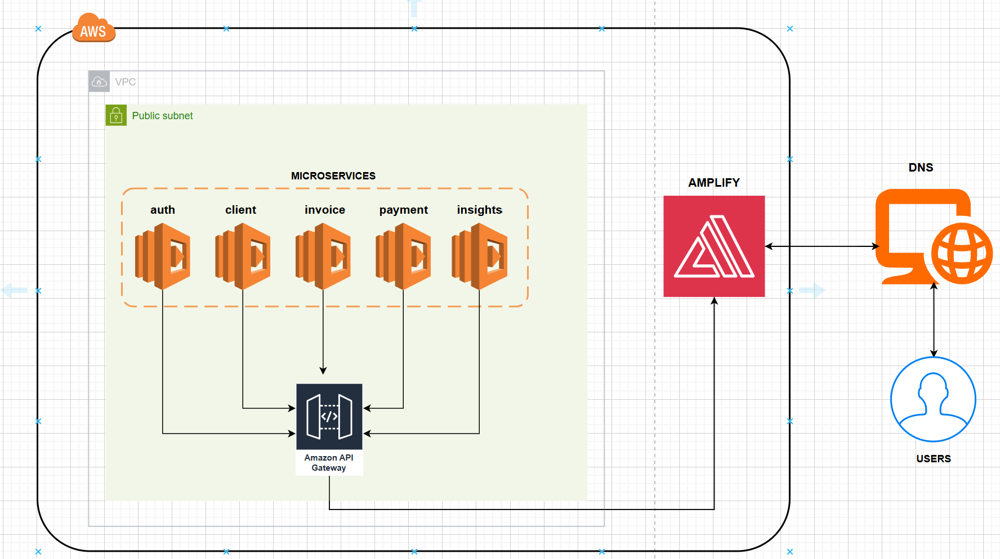
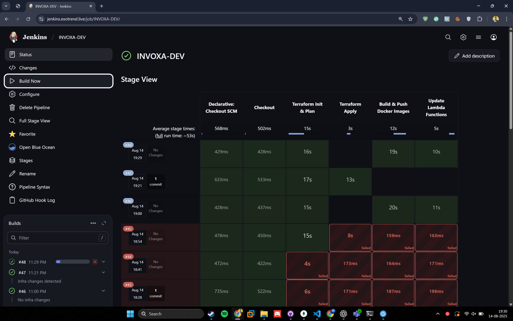
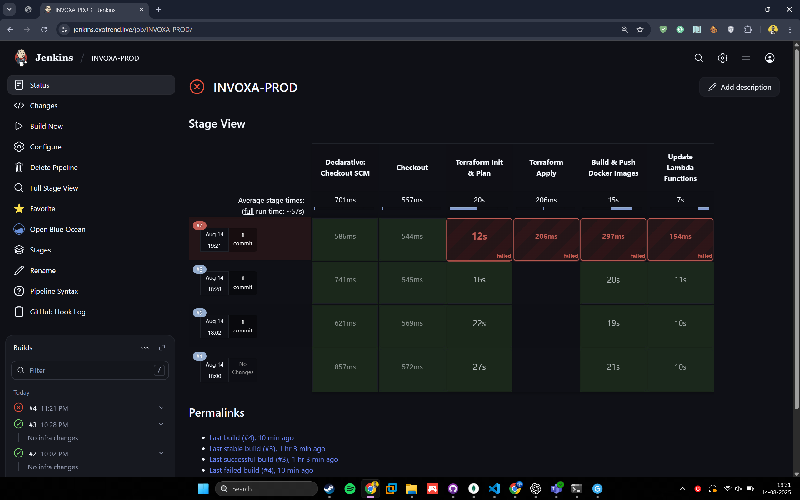
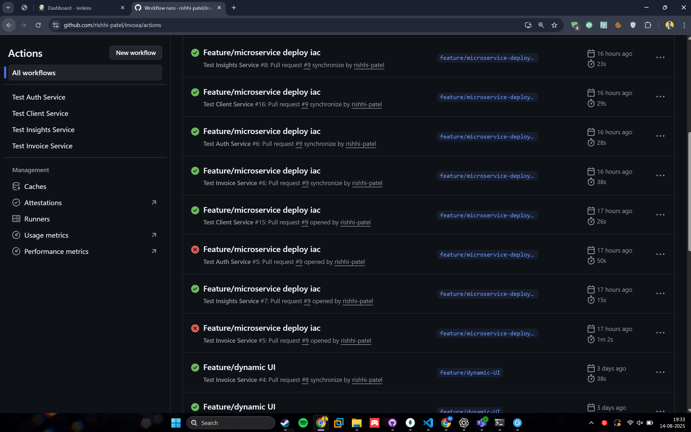
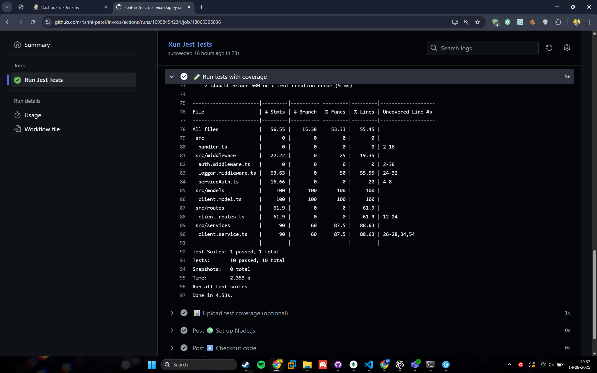
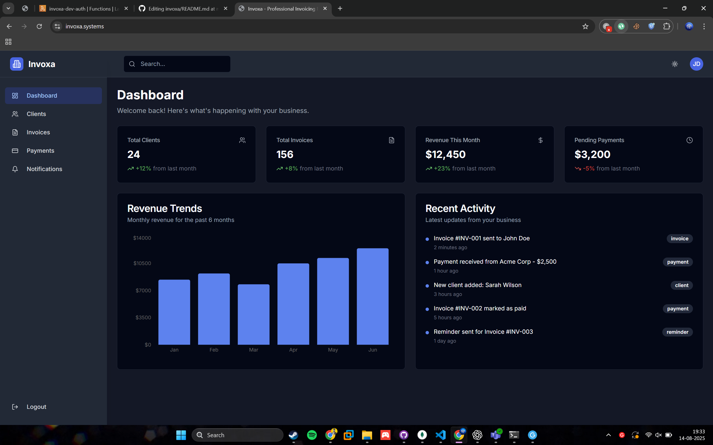

# 🚀 [INVOXA – Microservices Platform](https://invoxa.systems)

A modular, scalable, and cloud-ready **invoice-as-a-service** platform. INVOXA enables **authentication**, **client management**, **invoice generation**, **payments**, **notifications**, and **analytics** with a clean microservices architecture.

Built with ❤️ by **EXOcode Labs**.

---

## 📂 Project Structure

```
invoxa/
├── microservices/
│   ├── [auth-service](./microservices/auth-service/README.md)        # Authentication & JWT handling (Node.js / Express)
│   ├── [client-service](./microservices/client-service/README.md)    # Client data management (Node.js / Express)
│   ├── [invoice-service](./microservices/invoice-service/README.md)  # Invoice creation and management (Node.js / Express)
│   ├── [payment-service](./microservices/payment-service/README.md)  # Payment processing (Python / Flask)
│   ├── [notification-service](./microservices/notification-service/README.md) # Email & PDF notifications (Node.js / Puppeteer)
│   └── [insights-service](./microservices/insights-service/README.md) # Analytics & reporting (Node.js / Express)
├── frontend/                # Web frontend (Next.js or React-based)
├── infra/                   # Infrastructure-as-Code (Terraform / AWS CDK)
└── docker-compose.yaml      # Local development composition
```

---

## Architecture Diagram



## CI & CD (Jenkins)




## BUILD & TEST




## CLIENT



## 🛠 Prerequisites

Before running locally, ensure you have:

- [Docker](https://www.docker.com/)
- [Node.js](https://nodejs.org/) & npm (for Node-based services)
- [Python 3](https://www.python.org/) & pip (for Flask services)
- AWS CLI configured (for infrastructure deployment)
- Terraform (if deploying via IaC)

---

## 🚀 Running Locally

Clone the repository:

```bash
git clone https://github.com/your-username/invoxa.git
cd invoxa
```

Start **all services** with Docker Compose:

```bash
docker-compose up --build
```

---

## 🌐 Service Endpoints (Local Development)

| Service              | Technology      | Port / URL                              | Reference                                                                     |
| -------------------- | --------------- | --------------------------------------- | ----------------------------------------------------------------------------- |
| Auth Service         | Node.js/Express | http://localhost:3001                   | [auth-service README](./microservices/auth-service/README.md)                 |
| Client Service       | Node.js/Express | http://localhost:5001                   | [client-service README](./microservices/client-service/README.md)             |
| Invoice Service      | Node.js/Express | http://localhost:3002                   | [invoice-service README](./microservices/invoice-service/README.md)           |
| Payment Service      | Python/Flask    | http://localhost:5002                   | [payment-service README](./microservices/payment-service/README.md)           |
| Notification Service | Node.js/Express | http://localhost:3003                   | [notification-service README](./microservices/notification-service/README.md) |
| Insights Service     | Node.js/Express | http://localhost:3004                   | [insights-service README](./microservices/insights-service/README.md)         |
| Frontend             | Next.js/React   | http://localhost:3000 (if separate run) | [frontend README](./frontend/README.md)                                       |

---

## ⚙️ Deployment

1. **Infrastructure Setup** (Terraform or AWS CDK) – in `/infra`
2. **CI/CD Pipelines** – via GitHub Actions
3. **AWS ECS/ECR** for container orchestration
4. **Route 53 + ALB + ACM** for domain and HTTPS setup
5. **Secrets Manager** for environment variables

---

## 📌 Planned Features

- ✅ JWT-based authentication
- ✅ Modular microservices
- ✅ MongoDB integration for persistence
- ✅ Analytics dashboard in frontend
- ✅ GitHub Actions-based CI/CD deployment
- ⏳ AWS S3 for file storage
- ⏳ Email + PDF generation with Puppeteer (Notification Service)

---

## 🧑‍💻 Local Development Workflow

Run **only a specific service** (see each microservice's README for details):

```bash
cd microservices/<service-name>
npm install
npm run dev
```

Run **frontend** separately:

```bash
cd frontend
npm install
npm run dev
```

---

## 📦 Technologies Used

**Backend**

- Node.js (Express)
- Python (Flask)
- Puppeteer (PDF Generation)
- JWT for Authentication

**Frontend**

- React / Next.js
- Zustand for state management

**DevOps & Infra**

- Docker & Docker Compose
- Terraform / AWS CDK
- AWS ECS, ECR, Route 53, ALB, Secrets Manager
- GitHub Actions for CI/CD

---

## 🔔 Notification Service

Sends emails and generates pixel-perfect PDF invoices — effortlessly and reliably.
See [notification-service README](./microservices/notification-service/README.md) for setup and usage.
